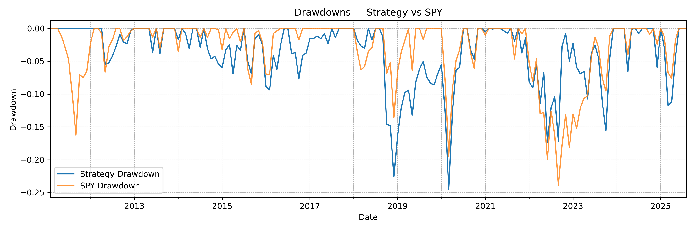

# Momentum Factor Equity Strategy with Backtest

This project implements and backtests a **cross-sectional 12–1 momentum factor strategy** on the S&P 500.  
The strategy forms monthly long/short portfolios by ranking stocks on their past 12-month returns (excluding the most recent month).  
Performance is evaluated against SPY as a benchmark, with transaction costs applied via turnover.  

## Key Features
- Historical S&P 500 constituents   
- Price data sourced via yfinance (auto-adjusted prices)  
- Cross-sectional momentum signal (12–1 lookback)  
- Dollar-neutral long/short portfolio construction  
- Transaction costs based on portfolio turnover  
- Performance metrics: CAGR, Sharpe ratio, max drawdown  
- Visualizations: equity curves, turnover, and portfolio stats  

## Results
The momentum strategy did not outperform SPY in this period:

- **Long-only (top 40)** delivered positive returns, but with **lower CAGR and Sharpe ratio** than SPY and **larger drawdowns**.  
- **Long/short (20/20)** performed poorly, with near-zero returns and severe drawdowns.  
- Overall, results suggest that a simple cross-sectional momentum factor in large-cap US equities is **not competitive** with buy-and-hold SPY.  
- The evidence also indicates that **the short side of momentum adds little or no value** in this setting.

### Example Equity Curve


## Data
The strategy requires a CSV of historical S&P 500 constituents which can be found in repository.

## How to Run
```bash
pip install -r requirements.txt
jupyter lab
```
Open cross_sectional_momentum_strategy.ipynb and run all cells,
or view the pre-run version with plots: cross_sectional_momentum_strategy.rendered.ipynb

## About 
Author: William Bradbury  
Affiliation: BSc Mathematics, University of Warwick
